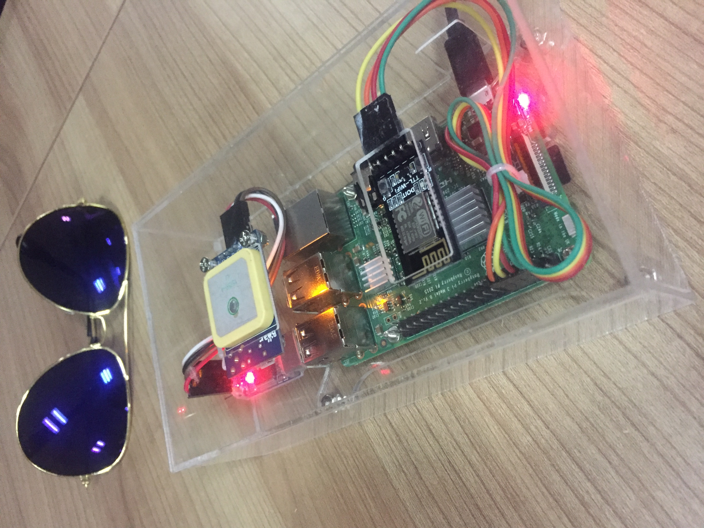
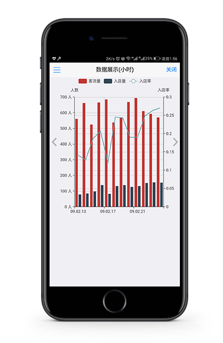

# 基于wifi探针的商业大数据分析技术

## Victors

## "Victors'WIFI"项目简介

- 本项目为第六届“中国软件杯”大学生软件设计大赛的参赛作品
- 题目：基于WIFI探针的商业大数据分析技术
- 开发团队：Victors
- 指导老师：刘钢
- 队长：汤佳辉
- 队员：郭欣光、赵鹏越

## "Victors'WIFI"之软硬件环境

### 硬件实现

- 主要硬件参数

    1. 50台基于ARM7架构的树莓派集群
    2. SanDisk 32G SD卡若干
    3. 48口千兆交换机一台
    4. Arduino Mega 2560单片机一块
    5. WIFI探针设备若干
    6. SIM900芯片一块
    7. ESP8285 WIFI芯片
    8. UAPT GPS模块
    9. USB-TTL
    10. 开关电源等

### 软件环境

- 搭载系统：Raspbian Jessie （Based on Debian Jessie）
- version-Linux内核：Linux4.9

### 实物拍摄

## "Victors'WIFI"之自制WIFI探针

- 项目全称：基于WIFI探针的商业大数据分析技术---"Victors'WIFI"
- 项目人员：汤佳辉、郭欣光、赵鹏越
- 程序目录：源代码，可执行程序/WIFI探针
- 开发语言：Python
- 开发工具：Vim7.3

### 自制WIFI探针程序目录相关说明

程序目录中 图片 文件夹与自制WIFI探针程序无关，里面的图片为Github项目README页面的说明。

### 自制WIFI探针主要元件说明

- Raspberry Pi 3B
- SanDisk 32G SD卡
- ESP8285 WIFI芯片
- UART GPS模块
- 陶瓷天线
- USB-TTL
- 杜邦线，亚克力，螺丝螺母等

### 自制WIFI探针功能先关说明

- 采集探测区域内的MAC地址、地理位置、rssi信号强度、与探针大概距离、采集时间等信息
- 与服务端无限通信，定时HTTP POST请求，实现采集数据持久化
- 支持在服务端进行相关配置（服务端IP、端口、路径、发送数据时间间隔及各项阙值）
- 支持各端远程在线控制（sms、微信、手机App以及web客户端）

### 自制WIFI探针采集数据格式说明

- Time---采集时间
- ProbeMac---探针自身MAC地址
- Rssi---信号强度
- Distance---与探针大概距离
- Lon---所在地理经度
- Lat---所在地理纬度

### 实物拍摄

## "Victors'WIFI"之短信服务

- 项目全称：基于WIFI探针的商业大数据分析技术---"Victors'WIFI"
- 开发人员：汤佳辉、郭欣光、赵鹏越
- 程序目录：源代码，可执行程序/sms服务
- 开发语言：Python，Arduino
- 开发工具：Vim 7.3 Arduino 1.6.9

### 短信服务程序目录相关说明

程序目录中 图片 文件夹与短信服务端程序无关，里面的图片为Github项目README页面的说明。

### 短信服务程序功能相关说明

- 远程控制探针采集设备状态
- 控制结果信息实时反馈
- 支持中英文

### 短信服务程序简要使用说明

- 发送短信内容为 开机 或 boot ，开启探针设备
- 发送短信内容为 关机 或 shutdown ，关闭探针设备
- 发送短信内容为 重启 或 reboot ，重启探针设备

### UI展示

## "Victors'WIFI"之微信服务

- 项目全称：基于WIFI探针的商业大数据分析技术---“Victors'WIFI”
- 开发人员：汤佳辉、郭欣光、赵鹏越
- 程序目录：源代码，可执行程序/微信服务
- 开发语言：Python
- 开发工具：Vim 7.3

### 微信服务程序目录相关说明

程序目录中 图片 文件夹与微信服务端程序无关，里面的图片为Github项目README页面的说明。

### 微信服务程序功能相关说明

- 远程在线控制探针采集设备的状态
- 在线快速获取多维度的店铺客流信息
- 支持菜单栏选项和关键字

### 微信服务程序简要使用说明

- 选择 设备控制 的菜单栏子选项进行探针设备的远程在线控制
- 发送 开机/关机/重启 的关键字进行探针设备的远程在线控制
- 选择 客流查询 的菜单栏子选项进行店铺客流信息的多维度数据查询
- 发送 查询时/查询天/查询周/查询月 的关键字进行店铺客流信息的多维度查询

### UI展示

## "Victors'WIFI"之移动APP

- 项目全称：基于WIFI探针的商业大数据分析技术---"Victors'WIFI"
- 开发人员：汤佳辉、郭欣光、赵鹏越
- 程序目录：源代码，可执行程序/web/app客户端/app客户端代码
- 开发语言：html5、javascript、css
- 开发工具：HBuilder 8.0.1

### 移动APP程序目录相关说明

程序目录中 图片 文件夹与移动APP客户端程序无关，里面的图片为Github项目README页面的说明。

### 移动APP程序功能相关说明

- 随时随地查询店铺详细信息
- 便捷监控服务节点工作状态
- 在线控制探针设备

### UI展示

## "Victors'WIFI"之WEB服务

- 项目全称：基于WIFI探针的商业大数据分析技术---"Victors'WIFI"
- 开发人员：汤佳辉、郭欣光、赵鹏越
- 服务器端程序目录：源代码，可执行程序/web/web服务器/web服务器代码/src
- 客户端程序目录：源代码，可执行程序/web/web客户端/web客户端代码
- 开发语言：Java、Html、css、Javascript
- 开发工具：Maven、IntelliJ IDEA 2016.1.3

### web服务程序目录相关说明

程序目录中 图片 文件夹与web服务端程序无关，里面的图片为Github项目README页面的说明

### web服务程序功能相关说明

- 店铺客流信息的实时数据动态展示
- 精准，高效，全面的离线查询
- 支持历史查询，环比及多维度比较
- 支持多店铺对比
- WIFI探针设备的实时状态监控
- 服务器设备的实时状态监控
- 远程在线控制探针设备，支持开关机，重启及设定自动开关机
- 在线配置探针
- 探针设备的定位，支持平面地图，卫星地图及三维地图

### web服务程序简要使用说明

- 点击 实时展示 ，查看店铺客流信息的实时动态展示
- 点击 离线查询 ，查看店铺客流信息的历史数据离线查询
- 点击 探针监控 ，对探针设备进行实时状态监控
- 点击 系统服务 ，对服务设备进行实时状态监控
- 点击 远程控制 ，远程在线配置及控制探针设备
- 点击 设备定位 ，多种类地图实时定位探针设备

### UI展示

## 项目客户端地址

- 短信服务号 155-9059-6925（已停用）
- 微信公众号：Victors
- web客户端地址：[http://www.rpiwifi.com](http://www.rpiwifi.com)（已停用）

## 项目视频演示

- git目录：视频/最终视频.mp4
- 爱奇艺在线连接：[http://www.iqiyi.com/w_19rtorga7x.html](http://www.iqiyi.com/w_19rtorga7x.html)
- 温馨提示：在线观看时请尽量选择1080p观看高清版哦！

## 关于我们

此项目为Victors团队汤佳辉、郭欣光、赵鹏越三人合力开发。 
联系方式Email：guoxinguang123@qq.com qq：352251493